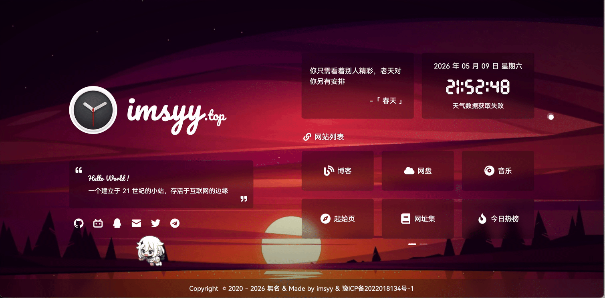

# imsyy/home pet add-on
---
## 一个基于imsyy/home项目的鼠标宠物插件
## A mouse pet add-on for imsyy/home

## 预览:
Preview:



## 宠物机制介绍:
Introduction to the Pet Mechanics

  * 离鼠标很远时：它会原地愣住一会，然后再开始跑。    When far away from the mouse: it will freeze in place for a while before starting to run.
  * 离鼠标较近时：它会慢悠悠地溜达过来。            When close to the mouse: it will sneak slowly.
  * 到了鼠标身边：它会乖乖停下来。                 When you get to the mouse: it will stop obediently.
  * 朝向变化：宠物会根据鼠标位置自动翻转朝向。       Orientation Change: The pet will automatically flip the orientation based on the mouse position.
  * 惯性效果：宠物移动时会有平滑的加速减速效果。     Inertia effect: The pet will have a smooth acceleration and deceleration effect when moving.
  * 个性气泡：跑步时会说"原来你跑到这里来了"，跟丢鼠标时会说"糟了...跟丢了"。     Personality bubbles: When running, you will say "So you came here", and when you lose the mouse, you will say "Oh no... I lost it."

## 属性更改:
  ```vue

  ```
### 插件安装说明:
---

### Installation Instructions:

1. 先下载作者imsyy的原项目[imsyy/home](https://github.com/imsyy/home/),
Download the original project by the author imsyy first:[imsyy/home](https://github.com/imsyy/home/)


2. 解压zip,进入目录,放入pet.vue和pet.png(图片大小建议控制在`700kB`以内),对应操作和路径如下:
Unzip the zip, enter the directory, put in pet.vue and pet.png (the image size is recommended to be controlled within `700kB`), and the corresponding operations and paths are as follows:
```markdown
home-dev
├── dist/
├── LICENSE
├── node_modules/
├── package.json
├── pet.png  <<<将宠物图片放置于此处,格式仅支持:png      Place your pet picture here, supported file type:png
├── public/
├── README.md
├── src/
│   ├── assets/
│   ├── components/
│   │   ├── Footer.vue
│   │   ├── Pet.vue  <<<将Pet.vue添加至此处    Add file Pet.vue here.
│   │   └── .....
│   ├── api/
│   ├── App.vue    <<<需要在这里添加一行代码      Need to add a line of code here
│   ├── main.js 
│   ├── store/
│   ├── style/
│   ├── utils/
│   └── views/
├── .....
└── vite.config.js
```

3. 找到App.vue,在第5行后添加一行代码:
Find App.vue and add a line of code after line 5:
```vue
  <Background @loadComplete="loadComplete" />                <----App.vue 第五行(line 5)
  <!-- 在此处加入以下一行代码   Add the following line of code here -->
  <Pet />
```
4. 构建,可以参考imsyy原项目的[手动构建](https://github.com/imsyy/home/)
For construction, you can refer to the [Manual Construction](https://github.com/imsyy/home/) section of the original imsyy project.
- **安装** [node.js](https://nodejs.org/zh-cn/) **环境**

  > node > 16.16.0  
  > npm > 8.15.0

- 然后以 **管理员权限** 运行 `cmd` 终端，并 `cd` 到 项目根目录
Then, run the `cmd` terminal with administrative privileges and navigate to the root directory of the project using `cd`.
- 在 `终端` 中输入：
- In `Terminal`, type:
```bash
# 安装 pnpm   (install pnpm)
npm install -g pnpm

# 安装依赖   install dependences
pnpm install

# 预览   preview
pnpm dev

# 构建
pnpm build
```
5. 构建之后(非常重要!):
After completion (very important!)
-以 **管理员权限** 运行 `cmd` 终端，并 `cd` 到 项目根目录
Then, run the `cmd` terminal with administrative privileges and navigate to the root directory of the project using `cd`.
- 在 `终端` 中输入：
- In `Terminal`, type:
```bash
#windows CMD
copy .\pet.png .\dist\assets\
#MacOS
cp ./pet.png ./dist/assets/
#windows PowerShell
cp ./pet.png ./dist/assets/
```
### 到这里,插件的安装就大功告成了!      静态资源会在`dist`目录中生成，可将`dist`文件夹下的文件上传至服务器，也可使用`Vercel`等托管平台一键导入并自动部署!
---
### At this point, the installation of the add-on is complete!     The files in the `dist` folder can be uploaded to the server or imported and automatically deployed with one click using a hosting platform such as `Vercel`.
